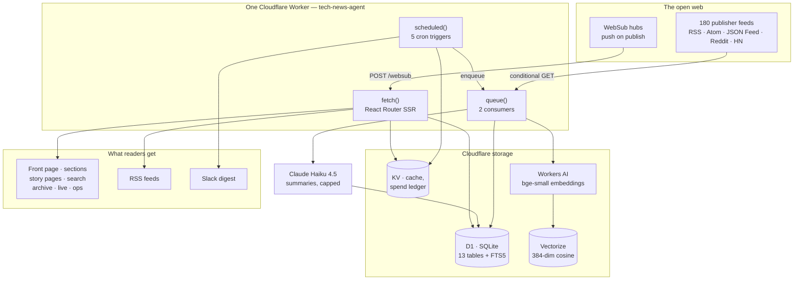
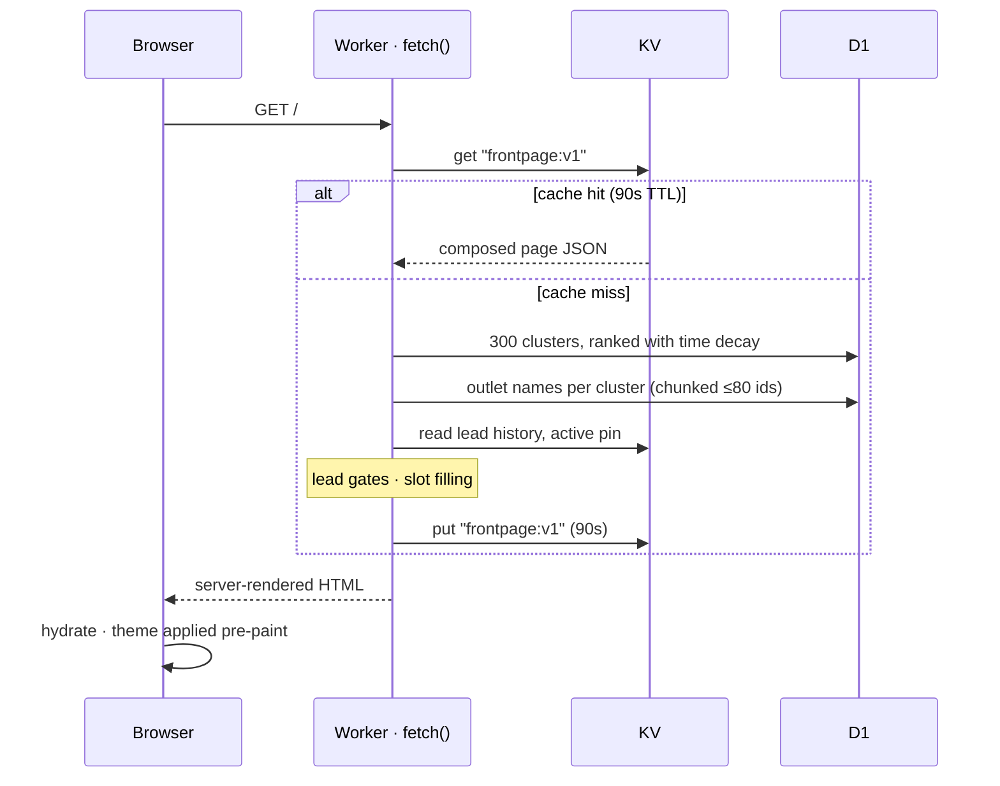
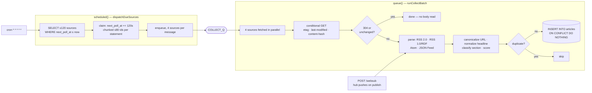
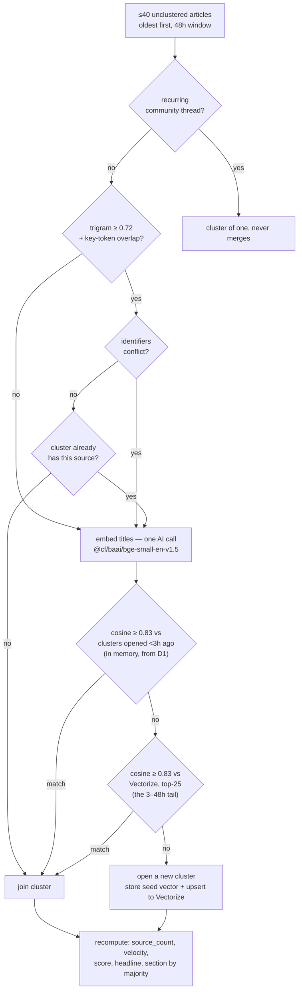
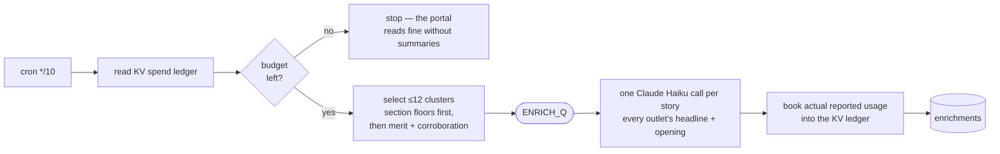
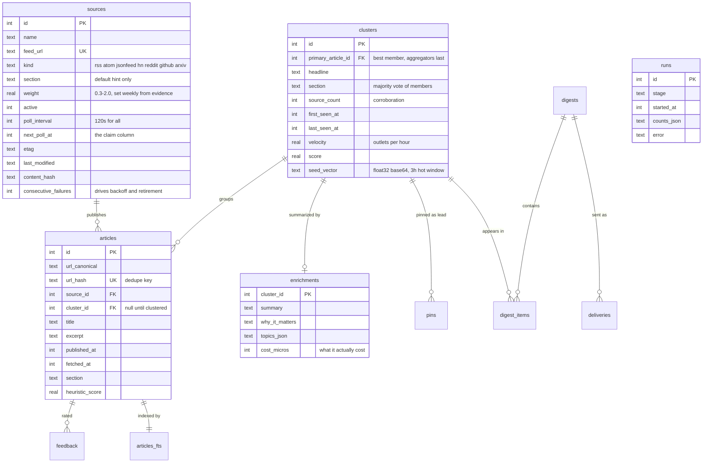
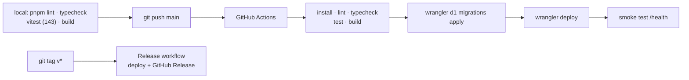

# Architecture

**v1.0.0 · verified against the running system on 5 September 2026.**

Every number here was read from the live deployment rather than from memory.

---

## What it is, in one paragraph

A single Cloudflare Worker that polls **180 RSS/Atom/JSON feeds every two
minutes**, deduplicates what it finds, groups articles about the same event
into *stories*, ranks them, optionally writes a summary of each story under a
hard daily spend cap, and serves the result as a newspaper-style front page,
section pages, a search index, a daily digest, an RSS feed and a Slack post.
There is no separate backend: the same Worker answers HTTP requests, runs the
cron schedule, and consumes the queues.

---

## The system at a glance



---

## Runtime: one Worker, three entrypoints

Everything lives in [`workers/app.ts`](../workers/app.ts). Cloudflare invokes
the same deployed script three different ways:

| entrypoint | invoked by | what it does |
|---|---|---|
| `fetch(request, env, ctx)` | an HTTP request | React Router renders a page or an API route |
| `scheduled(controller, env, ctx)` | one of 5 cron triggers | **enqueues work; never does it** |
| `queue(batch, env, ctx)` | a queue delivery | fetches feeds, writes summaries |

The separation is deliberate. `scheduled` only ever claims rows and pushes
messages, so a slow publisher can never stall the scheduler — a lesson learned
the hard way when a failing claim statement stopped collection dead for twelve
minutes while the rest of the cron kept running.

**There is no Node.js server, no container, and no always-on process.** The
Worker is a V8 isolate that starts on demand, runs, and stops. State lives
entirely in D1, KV and Vectorize.

### The stack

| layer | choice | version |
|---|---|---|
| Runtime | Cloudflare Workers (V8 isolates, `nodejs_compat`) | compat date 2025-01-09 |
| Framework | React Router (SSR + hydration) | 8.3.1 |
| UI | React | 19.2.8 |
| Language | TypeScript, strict | 5.9.3 |
| Build | Vite + `@cloudflare/vite-plugin` | 8.2.2 / 1.54.4 |
| Lint/format | Biome | 2.5.12 |
| Tests | Vitest + `@cloudflare/vitest-pool-workers` | 4.1.0 / 0.22.0 |
| Deploy | Wrangler, via GitHub Actions | 4.129.0 |
| XML | `fast-xml-parser` | 5.11.1 |
| LLM | `@anthropic-ai/sdk` | 0.124.0 |

CPU is capped at `limits.cpu_ms: 30000`; observability is on.

---

## The front end

React Router runs in **SSR mode**: the Worker renders HTML on the server, ships
it, then React hydrates for interactivity. That matters here because the data
lives in the same datacentre as the Worker — a loader reads D1 directly rather
than the browser making a second round trip.



### Routes

| path | renders | notes |
|---|---|---|
| `/` | front page | lead, 2-up hero, 4-across, 10 section columns, latest rail |
| `/s/:section` | one section | 10 sections |
| `/sections` | section index | why there is no per-section colour |
| `/story/:id` | one story | **arrival timeline** — who broke it, who followed |
| `/live` | raw arrival order | grouped by day |
| `/digest` | last 24 hours | fixed window, corroboration-weighted |
| `/archive?date=` | one past day | only days with content |
| `/search?q=` | FTS5 search | grouped to stories |
| `/saved` | reading list | client-side only |
| `/ops` | operations | read-only |
| `/health` | JSON health | bindings, budget, delivery config |
| `/raw`, `/census` | development checks | unstyled composition, headline stats |
| `/api/frontpage.json` | the composed page | same object the site renders |
| `/api/stories.json?ids=` | stories by id | serves `/saved` |
| `/feed.xml`, `/feed/:section.xml` | RSS 2.0 | 5-minute cache |
| `/websub` | hub callback | POST, signature-verified |

### Client-side state

Deliberately almost none. Two things live in `localStorage` and nowhere else:
the **theme** choice and the **saved list**. No account, no cookie, nothing
about what anyone reads stored on a server we control. The cost is that the
saved list does not follow you between devices.

Server-only code is kept out of the browser bundle by the `.server.ts` suffix —
React Router refuses the build if a client component imports one, which is why
`app/lib/sections.ts` exists to hold the section labels and `Story` type that
both sides need.

---

## Ingestion: how news actually arrives



### The four duplicate shapes

| shape | caught by |
|---|---|
| same item, same URL, next poll | `url_hash` UNIQUE + `ON CONFLICT DO NOTHING` |
| same item, URL dressed with tracking params / AMP / redirector | canonicalization before hashing |
| same item reposted by one source at a **different** URL | same source + same headline within 48h |
| same event from **different** outlets | **not dropped — clustered** |

The last row is the whole product. Six outlets covering one acquisition are not
six duplicates; they are corroboration, and hiding five of them would destroy
the signal that makes a story lead.

The 48-hour repost window was measured: the only genuine same-source duplicate
in the corpus was **0.3 hours** apart, while legitimate repeats (Rock Paper
Shotgun's weekly columns) were **168 and 169 hours** apart.

### Politeness

Conditional GET means a quiet feed answers `304` with no body. Failures back
off exponentially to a six-hour ceiling and honour `Retry-After`, so a
rate-limiting origin removes itself. Body cap 20 MB, timeout 25s.

---

## Clustering: turning articles into stories

This is the step that makes the economics work — one summary covers every
outlet that filed a story.



Every threshold was measured, not chosen — the evidence is in
[CLUSTERING.md](./CLUSTERING.md). Four plausible designs died against live
data:

1. **A "candidate" trigram band** escalating to embeddings. Reworded coverage
   scores *below* unrelated stories (0.198 vs 0.333), so the band would have
   carried more false pairs than true ones.
2. **Requiring the same section.** One story arrived classified `industry`,
   `gaming` and `consumer` by six outlets and became six clusters. Section is
   now *derived from* the cluster, not a constraint on it.
3. **Relying on Vectorize alone.** It is eventually consistent, so a burst of
   coverage never sees itself. Recent clusters keep their seed vector in D1.
4. **Unrestricted merging.** 10/10 cross-outlet merges were right; ~19 of 21
   same-outlet merges were wrong. One outlet never files the same story twice.

---

## Summarization and the budget



**Floors before merit.** Ranking purely on score would summarize AI and
hardware all day and leave Science and Cloud permanently blank, so each of the
ten sections gets a guaranteed 10 summaries a day, filled round-robin, and only
the remainder is competed for.

**The cap is checked before every call and booked afterwards** from the usage
the API actually reported — never from an estimate, which could drift low and
overspend. A corrupt ledger entry reads as *fully spent*, not zero: failing
open there would spend the day's budget twice.

Full arithmetic in [BUDGET.md](./BUDGET.md).

---

## Data model



### Live row counts

| table | rows | purpose |
|---|---:|---|
| `sources` | 187 | 180 active, 7 retired |
| `articles` | 4,397 | one row per item from one publisher |
| `articles_fts` | 4,397 | FTS5 shadow, kept in step by 3 triggers |
| `clusters` | 4,122 | one row per *story* |
| `runs` | 4,969 | every stage execution, for `/ops` |
| `enrichments` | 0 | summarizer dormant — no API key yet |
| `pins`, `digests`, `digest_items`, `deliveries`, `feedback`, `subscribers`, `preferences` | 0 | schema in place, features gated on auth/domain |

### Indexes that matter

```
sources  (active, next_poll_at)        ← the every-minute claim query
articles (cluster_id)                  ← cluster member lookups
articles (fetched_at DESC)             ← /live and recency
articles (section, fetched_at DESC)    ← section pages
clusters (score DESC, last_seen_at)    ← front-page ranking
runs     (stage, started_at DESC)      ← /ops
```

`articles_fts` is an external-content FTS5 table over `title` and `excerpt`
with `porter unicode61` tokenization, kept in sync by `articles_ai`,
`articles_ad` and `articles_au` triggers.

---

## Storage services and what each is for

| binding | service | holds | why this one |
|---|---|---|---|
| `DB` | D1 (SQLite) | everything durable + FTS5 | relational, transactional, 30-day Time Travel restore |
| `CACHE` | KV | composed front page (90s), counts (90s), **spend ledger**, lead history | fast global reads; the ledger tolerates eventual consistency because the cap sits under the true limit |
| `VECTORS` | Vectorize | one 384-dim seed vector per cluster, cosine | nearest-neighbour over the 3–48h tail |
| `AI` | Workers AI | `bge-small-en-v1.5` embeddings | runs in-datacentre, no key, cents per month |
| `COLLECT_Q` / `ENRICH_Q` | Queues | fetch and summarize work | back-pressure; the cron never blocks |
| — | Claude Haiku 4.5 | summaries | the only external API |

---

## The schedule

| cron | stage | work |
|---|---|---|
| `* * * * *` | schedule + cluster | claim ≤120 due sources and enqueue; cluster the last minute's arrivals |
| `*/10 * * * *` | websub + select | renew hub leases; spend remaining budget |
| `0 2 * * *` | maintain | prune vectors for closed clusters |
| `30 2 * * *` | deliver | compose the digest, post to Slack |
| `0 3 * * 1` | agent + discover + prune | reweight sources, retire the dead, **find new sources**, trim past retention |

Dispatch and clustering run under `Promise.allSettled` so neither can stop the
other, and each records its own row in `runs`.

---

## The weekly agent

Sources are reweighted from evidence the pipeline already produces, with
nothing to rate by hand. Clustering measures trust for free: a source whose
stories several independent newsrooms also file is reporting real events, and
one that is *first* into a cluster others later join broke the story. Both are
rates, so a small careful outlet is not punished for publishing less than a
firehose, and weights ease a third of the way toward their target each week so
one quiet fortnight cannot bury a publisher.

Feeds that stop answering are retired after 24 consecutive failures and eight
are retried each week — capped, because unbounded revival makes a dead feed
flap between states forever.

The same pass **finds new sources**. Aggregator feeds link out, so a domain
appearing repeatedly in Hacker News or Lobsters submissions has been vouched
for by people — a better filter than any list. Each candidate is probed for a
feed (the page's own `<link rel="alternate">` first, then the paths most
publishers use), verified to parse with at least three usable items, and added
at low weight. At most ten a week.

Coverage is judged on **who produced an article, not the feed's address**: if
any non-aggregator source has produced an article on a host, that host is
already ours however its feed is addressed. Comparing hostnames instead looked
right and re-proposed five publishers we already had within a single run,
because feeds so often live on a different subdomain than the articles.

Dispatch capacity is derived from the live source count for the same reason —
a fixed per-tick number silently breaks a two-minute sweep as soon as the list
outgrows it, and the list is designed to grow.

---

## Deploy and CI



Three workflows: `ci.yml` (branches and PRs), `deploy.yml` (push to `main`),
`release.yml` (tags). All four jobs carry `CLOUDFLARE_API_TOKEN` and
`CLOUDFLARE_ACCOUNT_ID` at job level — the *test* step needs them too, because
Vectorize and Workers AI have no local emulator and the vitest pool opens a
remote proxy session.

Migrations are forward-only, numbered, and applied before the deploy.

---

## Costs

| | per month |
|---|---|
| Workers Paid | $5.00 |
| Claude Haiku, capped at $0.45/day | $13.50 |
| Queues (4 sources per message) | ~$1.10 |
| D1, KV, Vectorize, Workers AI | under $0.50 |
| **Total** | **under $20** |

Queue messages carry four sources rather than one specifically because at a
two-minute cadence across 180 sources, one-per-message would have been the
second largest line on the bill after Workers itself.

---

## What is deliberately not here

Worth knowing so nobody goes looking for it:

- **No ORM.** `drizzle-orm`, `drizzle-kit` and `zod` are declared in
  `package.json` but **imported nowhere**, and `app/db/` is an empty directory
  — leftovers from the original scaffold. Every query is hand-written SQL
  against D1's prepared-statement API. They are safe to remove.
- **No authentication.** `/ops` is read-only and pinning a lead is done
  directly against D1, because writes need auth and auth is gated on the domain
  decision.
- **No email.** There is nowhere to send from without a domain.
- **No R2.** D1 Time Travel is the backup: 30 days of point-in-time restore,
  free on the paid plan, against an export that would be staler and unverified.
- **No client-side data fetching** except `/saved`, which asks
  `/api/stories.json` for ids held in the browser.
- **No server-side session or user record of any kind.**

## Two limits that have bitten twice each

Both worth remembering before changing anything near them:

1. **D1 caps a statement at 100 bound parameters.** It broke the front page's
   outlet lookup, and later stopped collection entirely for twelve minutes when
   the per-tick source claim went to 120 ids. Both are chunked now.
2. **Vectorize is eventually consistent.** A vector upserted moments ago is not
   reliably queryable, which is precisely the window a breaking story arrives
   in. Hence the in-memory hot tier.
